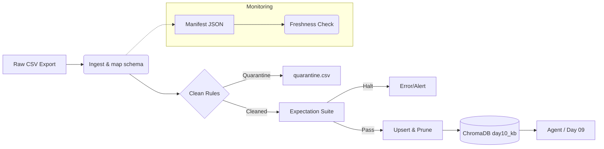

# Kiến trúc pipeline — Lab Day 10

**Nhóm:** Nhóm Antigravity  
**Cập nhật:** 2026-04-15

---

## 1. Sơ đồ luồng (bắt buộc có 1 diagram: Mermaid / ASCII)

> **Ghi chú**: Từng lần chạy được gán `run_id`, manifest ghi lại độ trễ `freshness` dựa trên cột `exported_at` của dòng mới nhất.

---

## 2. Ranh giới trách nhiệm

| Thành phần | Input | Output | Owner nhóm |
|------------|-------|--------|--------------|
| Ingest | Export CSV/API | List of Dict (raw schema) | Phan Hoài Linh |
| Transform | List of Dict (raw) | Cleaned rows + Quarantine rows | Phan Hoài Linh |
| Quality | Cleaned rows | Expectation Results + Halt signal | Phan Hoài Linh |
| Embed | Cleaned rows (nếu pass) | Upserted ChromaDB + pruned ids | Phan Hoài Linh |
| Monitor | Manifest + Cleaned CSV | SLA Alert / FRESHNESS check | Phan Hoài Linh |

---

## 3. Idempotency & rerun

- **Mô tả**: Khi đưa vào Vector Database (Chroma), nhóm thực hiện IDEMPOTENT bằng chiến thuật **Upsert theo `chunk_id`**.
- Chunk ID được băm (hash SHA-256) một cách ổn định (stable) dựa trên `doc_id`, `chunk_text`, và `seq`. Việc rerun 2 hay nhiều lần sẽ đưa ra `chunk_id` y chang như cũ, do đó database sẽ nhận dạng cập nhật thay vì thêm mới (duplicate).
- Điểm vượt trội (Baseline): Để tránh rác/nội dung mồi từ bản trước, sau khi load id mới vào index, pipeline quét các ID không còn tồn tại trong list và tiến hành prune (xoá chúng đi).

---

## 4. Liên hệ Day 09

- Pipeline này đóng vai trò ETL chuẩn bị và cập nhật `collection` trong ChromaDB. 
- Multi-agent Day 09 sẽ lấy thẳng Context Vector từ collection này (cùng `data/docs/` / `chroma_db`). Nếu collection cũ hỏng hoặc có policy stale chứa "14 ngày làm việc", Agent sẽ trả lời sai; pipeline này đã cách ly rủi ro đó ngay trước cửa ngõ, cung cấp `day10_kb` collection chuẩn cho RAG.

---

## 5. Rủi ro đã biết

- Hiện dùng fallback Local Hash Embeddings nếu không cài Sentence-Transformers. Điều này tốt cho Demo nhưng không mang lại tính Semantic, cần đảm bảo model hoạt động ổn trên Production.
- `freshness_check` bị phụ thuộc tuyệt đối vào cột thời gian export do nguồn hệ thống sinh ra. Nếu Clock sync ở nguồn lệch, freshness có thể đo sai hoặc gây lỗi Fail giả mạo.
